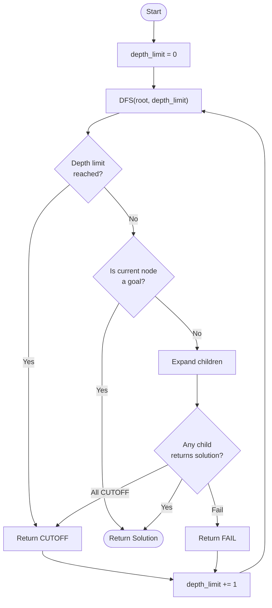
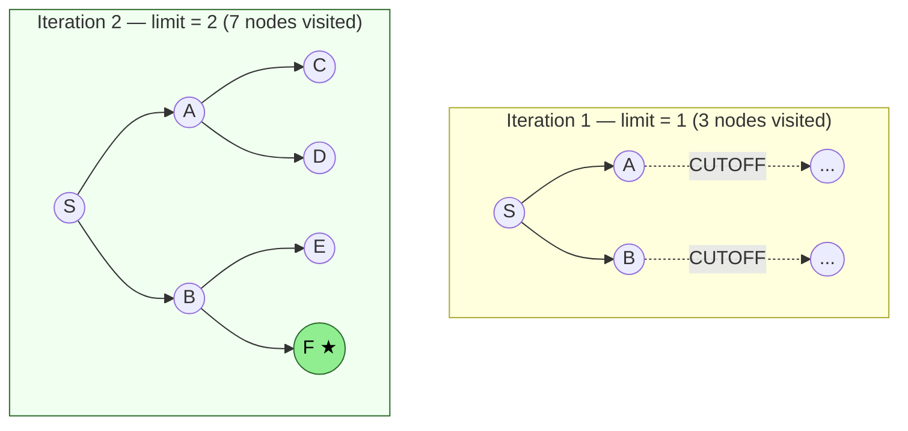
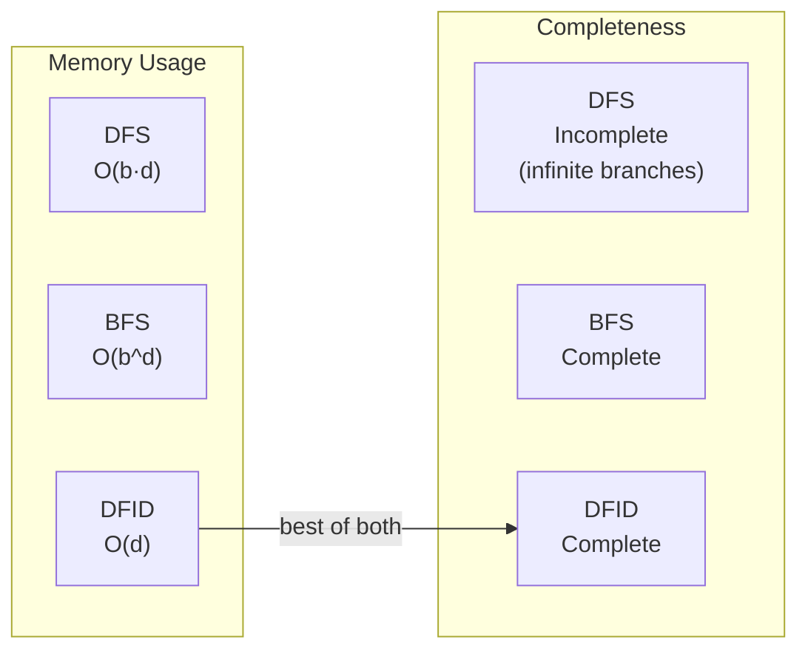
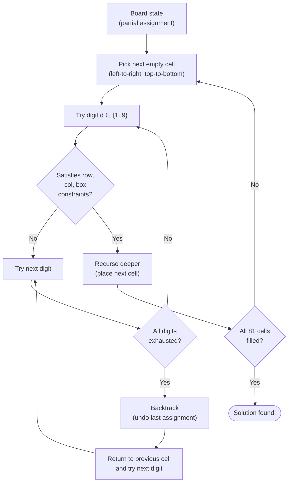
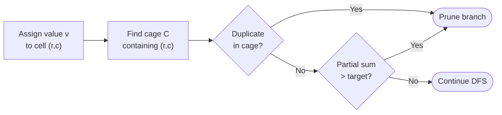

# Depth-First Iterative Deepening (DFID)

DFID runs DFS repeatedly with an increasing depth limit.
It has the **memory efficiency of DFS** (O(d)) and the **completeness of BFS**.

---

## Algorithm Flowchart

---

## Search Tree — How the Depth Limit Grows

Each iteration re-expands shallower nodes. The **overhead is small** because most nodes are at the deepest level (branching factor b: ~b^d nodes total vs ~b^(d-1) re-expanded nodes).

> **★ Goal found** at depth 2, second iteration.

---

## DFID vs DFS vs BFS

---

## Applied to Sudoku

### Killer Sudoku Extension

On top of the standard constraints, each assignment also checks:

---

## Complexity

| Metric | Value |
|--------|-------|
| Time | O(b^d) — same as BFS |
| Space | **O(d)** — only current path |
| Completeness | Yes (finite branching) |
| Optimality | Yes (unit step cost) |

> For Sudoku: branching factor b ≤ 9, depth d = number of empty cells (up to 81).
