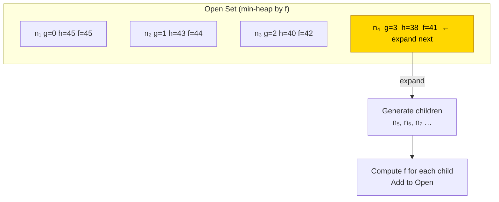
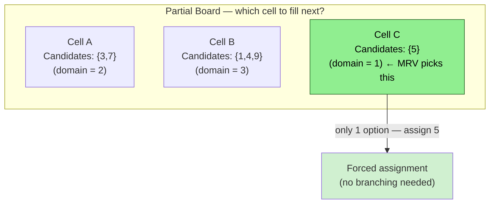
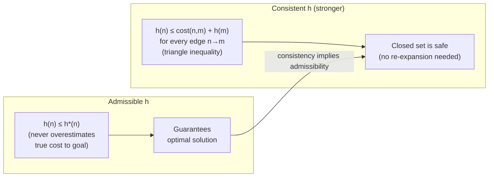

# A\* Best-First Search

A\* expands nodes in order of **f(n) = g(n) + h(n)** — the estimated total cost through node n.
With an **admissible** heuristic (h never overestimates), A\* is **complete and optimal**.

---

## The Core Formula

```
f(n) = g(n) + h(n)

  g(n) — exact cost from start to n   (cells already placed)
  h(n) — estimated cost from n to goal (cells still to place)
  f(n) — estimated total cost of path through n
```

---

## Algorithm Flowchart

```mermaid
flowchart TD
    START([Start]) --> INIT["Open  = {start}\nClosed = {}"]
    INIT --> EMPTY{Open set\nempty?}
    EMPTY -- Yes --> FAIL(["No solution"])
    EMPTY -- No --> POP["Pop node n with\nlowest f(n) from Open"]
    POP --> GOAL{n is\ngoal?}
    GOAL -- Yes --> SUCCESS(["Return solution path"])
    GOAL -- No --> ADD_CLOSED["Add n to Closed"]
    ADD_CLOSED --> EXPAND["For each neighbour m\nof n"]
    EXPAND --> IN_CLOSED{m in\nClosed?}
    IN_CLOSED -- Yes --> SKIP["Skip m"]
    IN_CLOSED -- No --> BETTER{m not in Open\nOR new g(m)\n< old g(m)?}
    BETTER -- Yes --> UPDATE["g(m) = g(n) + cost(n,m)\nh(m) = heuristic(m)\nf(m) = g(m) + h(m)\nAdd/update m in Open"]
    BETTER -- No --> SKIP
    SKIP --> EXPAND
    UPDATE --> EXPAND
    EXPAND --> EMPTY
```

---

## Priority Queue (Open Set) Visualised

Nodes are ordered by **f(n) ascending**. A\* always expands the most promising node.



---

## Heuristics for Sudoku

### h₁ — Empty Cell Count (weak, but admissible)

```
h(n) = number of empty cells remaining
```

Simple and fast, but ignores constraint information.

### h₂ — MRV (Minimum Remaining Values) ← recommended

```
h(n) = Σ  (domain_size(c) - 1)   for each empty cell c
           ↑ legal values that can still be placed in c
```

MRV prefers cells with the **fewest legal values** — detect dead-ends early.



### h₃ — Constraint Degree (tie-breaker)

When two cells have the same domain size, pick the one involved in **more unsatisfied constraints** (row + col + box peers that are still empty).

---

## A\* Search Tree Example

```mermaid
graph TD
    ROOT["Root\ng=0  h=50  f=50"]

    ROOT --> N1["Place 3 at (0,2)\ng=1  h=48  f=49"]
    ROOT --> N2["Place 7 at (0,2)\ng=1  h=49  f=50"]
    ROOT --> N3["Place 9 at (0,2)\ng=1  h=47  f=48  ← lowest f"]

    N3 --> N4["Place 5 at (1,0)\ng=2  h=45  f=47"]
    N3 --> N5["Place 5 at (3,1)\ng=2  h=44  f=46  ← lowest f"]

    N5 --> GOAL(["Goal — all cells filled\ng=81  h=0  f=81"])

    style N3 fill:#FFD700,stroke:#b8860b,color:#000
    style N5 fill:#FFD700,stroke:#b8860b,color:#000
    style N2 fill:#ffcccc,stroke:#cc0000
    style GOAL fill:#90EE90,stroke:#2d6a2d,color:#000
```



> Yellow = expanded (lowest f). Red = pruned or not reached. Green = goal.

---

## Admissibility & Consistency



Both **h₁** and **h₂** above are admissible and consistent for Sudoku.

---

## Complexity

| Metric | Value |
|--------|-------|
| Time | O(b^d) worst case — exponential |
| Space | O(b^d) — stores entire open set |
| Completeness | Yes (finite graph, non-negative costs) |
| Optimality | Yes (admissible heuristic) |

> Memory is A\*'s main weakness. For Sudoku (d ≤ 81) this is manageable.
