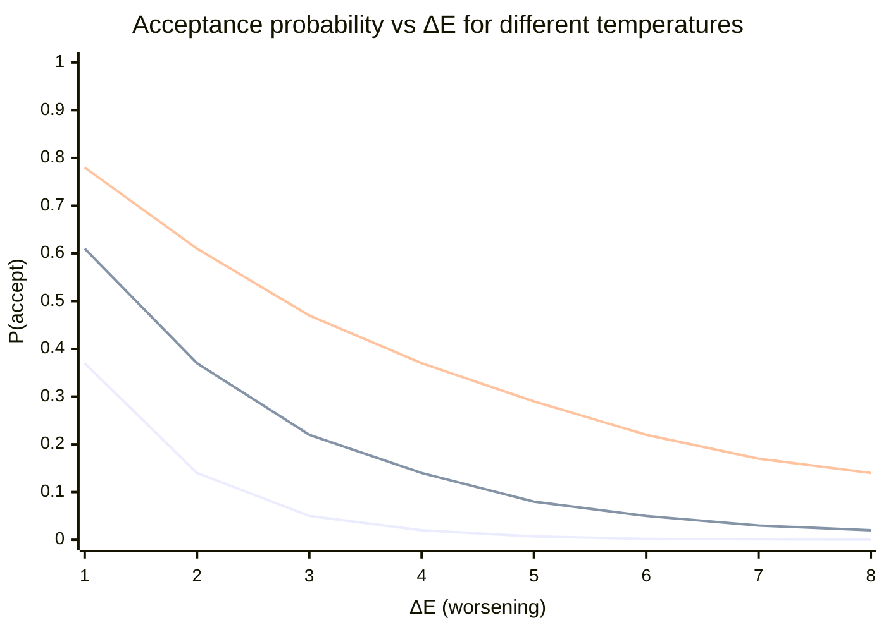
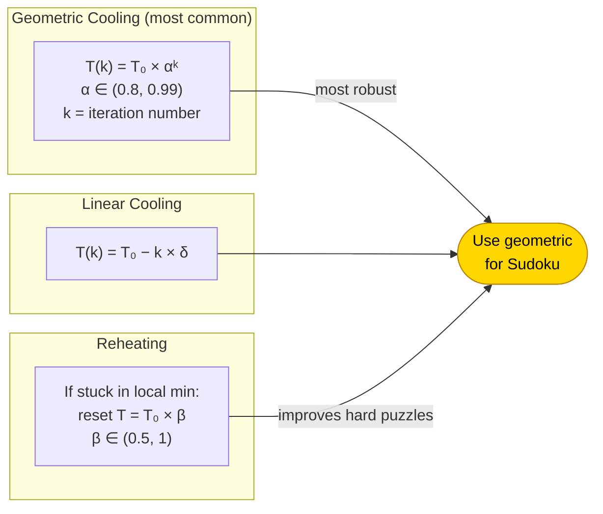
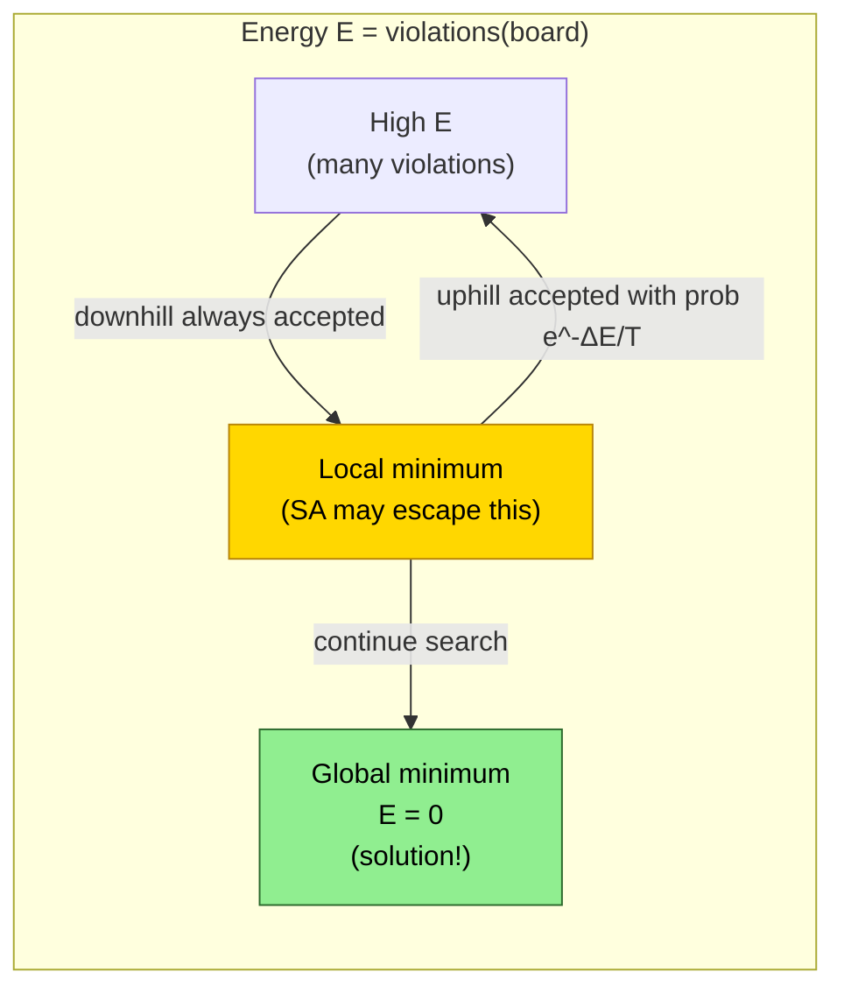
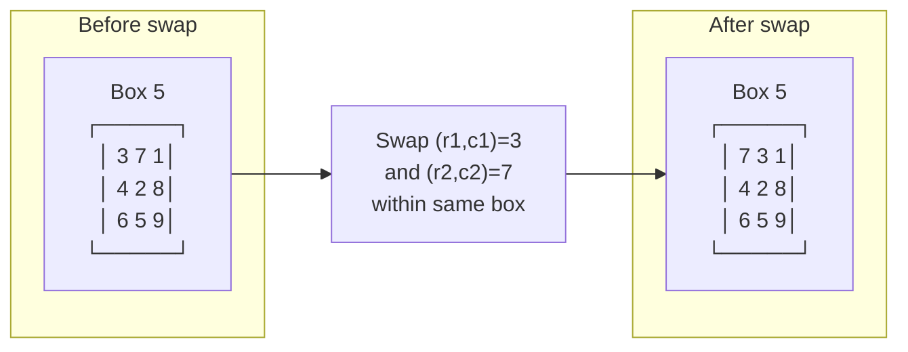

# Simulated Annealing (SA)

Inspired by metallurgical annealing: a hot system can escape local minima;
as temperature drops it settles into a (near-)global minimum.

---

## Core Idea

```
Start with a random (complete) board.
Repeatedly make small changes (moves).
  — If the move improves the score  → always accept it.
  — If the move worsens the score   → accept it with probability e^(-ΔE / T).
Slowly lower T until no bad moves are accepted.
```

---

## Algorithm Flowchart

```mermaid
flowchart TD
    START([Start]) --> INIT["Generate random\ncomplete board S\nSet T = T_max"]
    INIT --> EVAL["E = violations(S)"]
    EVAL --> SOLVED{E = 0?}
    SOLVED -- Yes --> DONE(["Solution found!"])
    SOLVED -- No --> NEIGHBOR["Generate neighbour S'\nby swapping two cells\nin the same box"]
    NEIGHBOR --> DELTA["ΔE = violations(S') − violations(S)"]
    DELTA --> BETTER{ΔE < 0?}
    BETTER -- Yes --> ACCEPT["Accept S' → S = S'"]
    BETTER -- No --> PROB["Accept with probability\np = e^(−ΔE / T)"]
    PROB --> LUCKY{random() < p?}
    LUCKY -- Yes --> ACCEPT
    LUCKY -- No --> REJECT["Reject S' — keep S"]
    ACCEPT --> COOL["T = T × α  (cool down)"]
    REJECT --> COOL
    COOL --> FROZEN{T < T_min?}
    FROZEN -- No --> NEIGHBOR
    FROZEN -- Yes --> RESTART["Restart?\n(reheat)"]
    RESTART -- Yes --> INIT
    RESTART -- No --> BEST(["Return best S found"])
```

---

## Acceptance Probability — e^(−ΔE / T)

Higher temperature → more likely to accept worse moves (exploration).
Lower temperature → only accept improvements (exploitation).



> Line 1 = T=1 (cold), Line 2 = T=2, Line 3 = T=3 (hot)

---

## Temperature Schedule



---

## Energy Landscape



---

## Evaluation Function (Violations)

```
violations(board) = Σ row_violations
                  + Σ col_violations
                  + Σ box_violations
                  [+ Σ cage_violations  ← Killer Sudoku]

row_violations(r)  = 9 − |unique values in row r|
col_violations(c)  = 9 − |unique values in col c|
box_violations(b)  = 9 − |unique values in box b|
cage_violation(g)  = 1 if sum(cage) ≠ target OR duplicate in cage
```

**Goal: violations = 0**

---

## Move Operator — Box Swap



> Swapping within a box preserves digit uniqueness per box — only row/col violations change.

---

## Parameters Tuning

| Parameter | Typical Range | Effect |
|-----------|--------------|--------|
| T₀ (initial temp) | 1.0 – 5.0 | Higher → more exploration at start |
| T_min | 0.001 – 0.1 | Lower → longer run, better quality |
| α (cooling rate) | 0.90 – 0.999 | Closer to 1 → slower cooling |
| Iterations per T | 100 – 10 000 | More → better but slower |
| Restarts | 3 – 20 | Escape repeated local minima |
