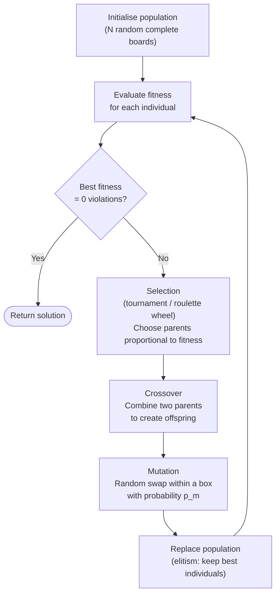
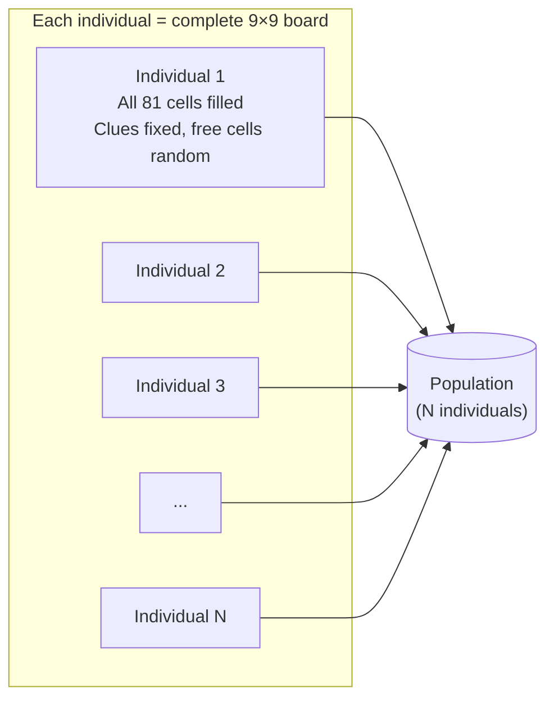
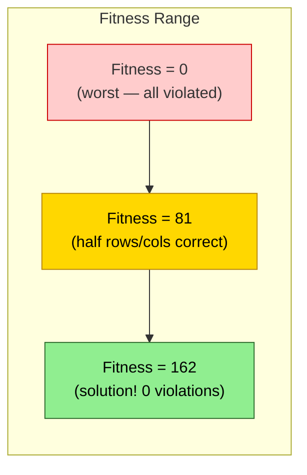
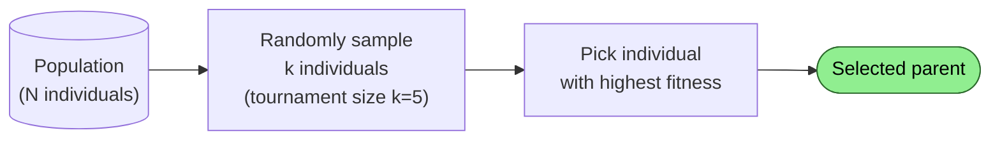
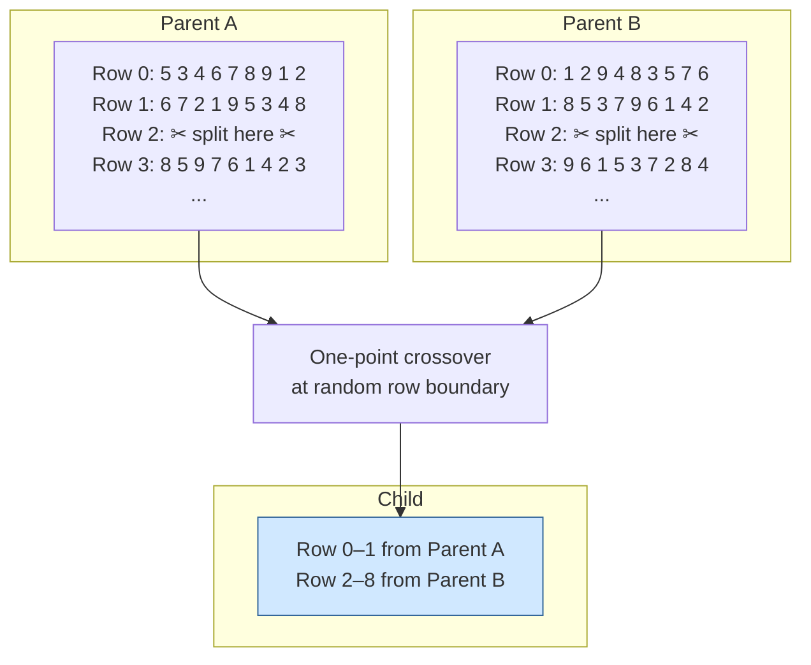
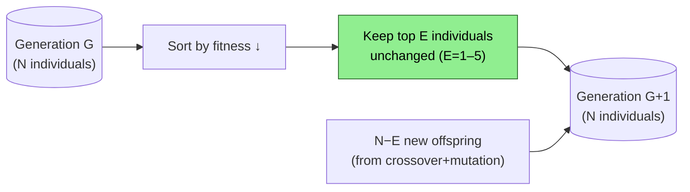
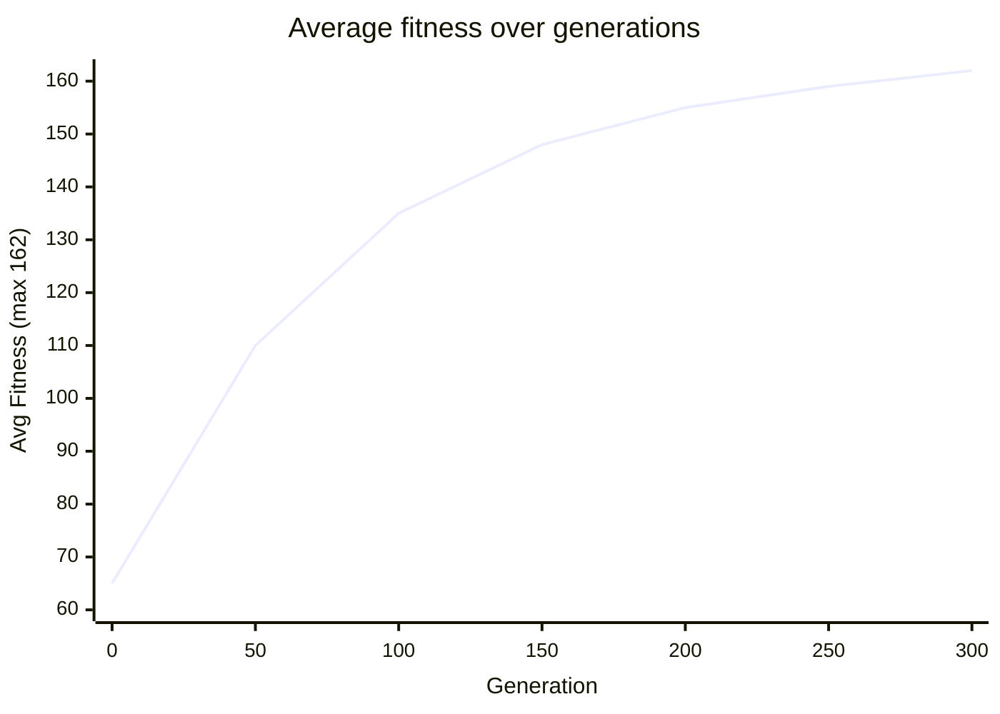

# Genetic Algorithm (GA)

GA maintains a **population** of candidate solutions and evolves them over generations
using selection, crossover, and mutation — mimicking natural evolution.

---

## Evolutionary Cycle



---

## Population Initialisation



> Clue cells (given digits) are **always fixed** — only free cells vary.

---

## Fitness Function

```
fitness(individual) = max_score − violations(individual)

violations = Σ row_violations + Σ col_violations
             [+ Σ cage_violations  ← Killer Sudoku]

max_score  = 9 rows × 9 + 9 cols × 9 = 162  (no box violations by construction)
```

Higher fitness = fewer violations = better board. **Target: fitness = max_score**.



---

## Selection — Tournament



> Repeat twice to get two parents for crossover.

---

## Crossover — Row-Based



---

## Mutation — Box Swap

```mermaid
flowchart LR
    CELL["For each free cell\nin the individual"]
    CELL --> ROLL{random() < p_m?}
    ROLL -- No --> NEXT["Next cell"]
    ROLL -- Yes --> PICK["Pick another\nrandom free cell\nin the SAME box"]
    PICK --> SWAP["Swap values"]
    SWAP --> NEXT
    NEXT --> DONE(["Mutated individual"])
```

> Mutation rate p_m is typically 0.01 – 0.05.

---

## Elitism



Elitism guarantees the best solution found is **never lost**.

---

## Generation Progression



---

## Parameters

| Parameter | Typical Value | Effect |
|-----------|--------------|--------|
| Population size N | 100 – 1000 | Larger → better diversity, slower |
| Crossover rate p_c | 0.7 – 0.9 | Higher → more recombination |
| Mutation rate p_m | 0.01 – 0.05 | Higher → more exploration |
| Tournament size k | 3 – 7 | Larger → stronger selection pressure |
| Elitism E | 1 – 5 | Preserves best solutions |
| Max generations | 1 000 – 10 000 | Stop condition |
