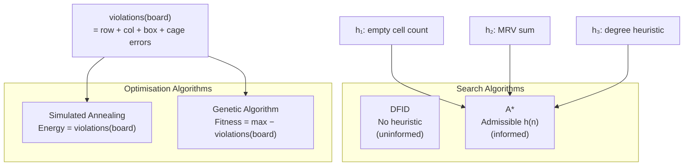
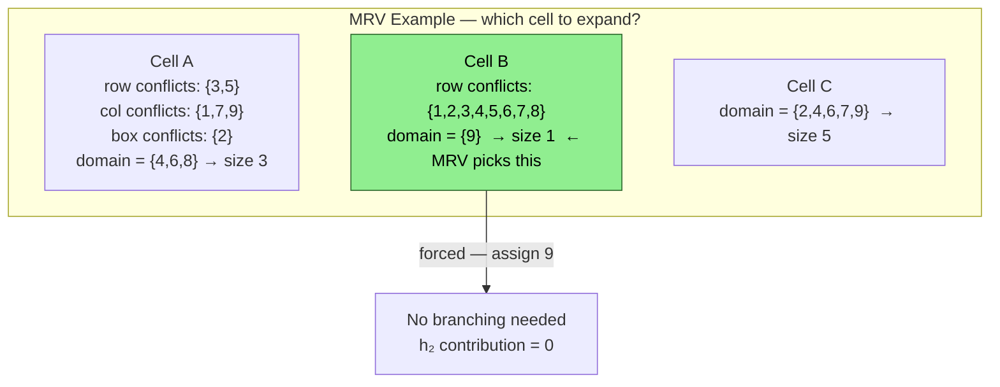
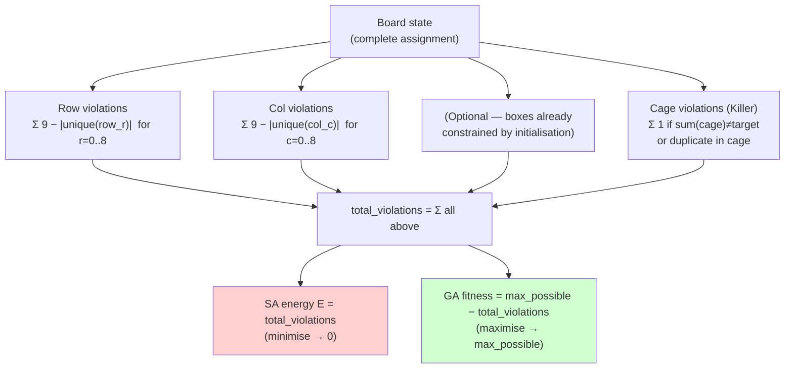
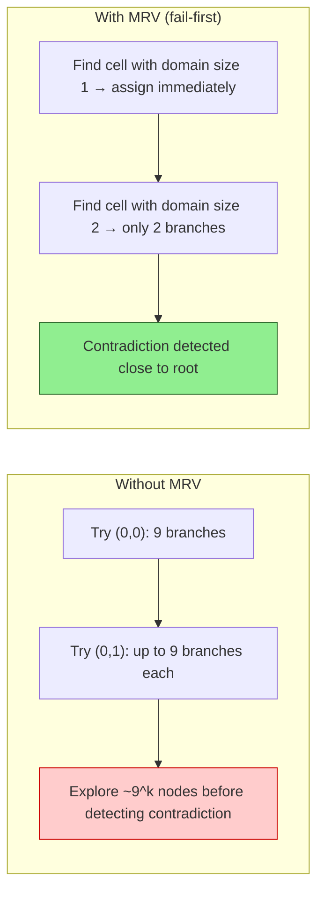

# Heuristics & Evaluation Functions

Cross-algorithm reference for every heuristic and scoring function used in this project.

---

## Overview



---

## A\* Heuristics

### h₁ — Empty Cell Count

```
h₁(n) = |{ cells (r,c) : board[r][c] = 0 }|
```

| Property | Status |
|----------|--------|
| Admissible | Yes — always ≤ true cost |
| Consistent | Yes |
| Informative | Low — ignores constraints |
| Computation | O(1) |

### h₂ — MRV (Minimum Remaining Values)

```
h₂(n) = Σ  max(0,  domain(c) − 1)
        c ∈ empty_cells

domain(c) = { d ∈ 1..9 : d not in row(c) ∪ col(c) ∪ box(c) }
```



| Property | Status |
|----------|--------|
| Admissible | Yes |
| Consistent | Yes |
| Informative | High — exploits constraint propagation |
| Computation | O(empty_cells × 27) |

### h₃ — Degree Heuristic (tie-breaker)

Used when two cells have the same MRV score:

```
degree(c) = |{ c' ∈ empty_cells : c' shares row, col, or box with c }|
```

Pick the cell with the **highest degree** — it will prune the most branches.

---

## Violations Function (SA & GA)



---

## Heuristic Comparison

| | DFID | A\* h₁ | A\* h₂ (MRV) | SA | GA |
|---|---|---|---|---|---|
| Informed | No | Weak | Strong | Yes (local) | Yes (population) |
| Admissible | — | Yes | Yes | N/A | N/A |
| Guides search | No | Slightly | Strongly | Via ΔE | Via fitness |
| Complexity | O(1) | O(1) | O(n) | O(n) | O(N·n) |
| Helps with hard puzzles | No | Little | Yes | Yes (restarts) | Yes (diversity) |

---

## Why MRV Works Well for Sudoku



MRV implements a **fail-first** strategy: cells most likely to cause a contradiction are tried first, cutting large portions of the search tree early.

---

## Killer Sudoku — Extra Constraint Propagation

For A\*, cage constraints allow additional pruning beyond MRV:

```
For a cage with target T and cells {c₁, c₂, ..., cₖ}:

  — min achievable sum  = Σ min(domain(cᵢ))
  — max achievable sum  = Σ max(domain(cᵢ))

  If T < min_sum  OR  T > max_sum → prune entire branch
```

This is integrated into h₂ to make it **Killer-aware** without losing admissibility.
