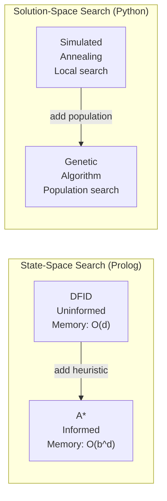

# Algorithm Diagrams

Visual reference for every algorithm used in this project.
All diagrams render natively on GitHub via Mermaid.

| File | Algorithm | Type |
|------|-----------|------|
| [01-dfid.md](01-dfid.md) | Depth-First Iterative Deepening | Uninformed search (Prolog) |
| [02-astar.md](02-astar.md) | A\* Best-First Search | Informed search (Prolog) |
| [03-simulated-annealing.md](03-simulated-annealing.md) | Simulated Annealing | Optimisation (Python) |
| [04-genetic-algorithm.md](04-genetic-algorithm.md) | Genetic Algorithm | Optimisation (Python) |
| [05-heuristics.md](05-heuristics.md) | Heuristics & Evaluation Functions | Cross-algorithm reference |

---

## Quick Comparison

### Key Properties

| Property | DFID | A\* | SA | GA |
|----------|------|-----|----|----|
| Complete | Yes | Yes | No | No |
| Optimal | Yes (unit cost) | Yes (admissible h) | No | No |
| Memory | O(d) | O(b^d) | O(1) | O(pop) |
| Heuristic | None | h(n) | ΔE / T | Fitness |
| Guarantee | Solution or fail | Optimal solution | Local minimum | Near-optimal |
